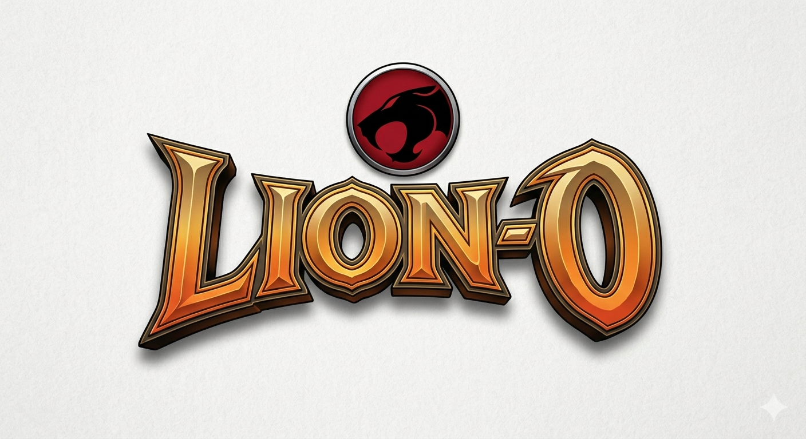

A short 3D action adventure demo built in the style of *The Legend of Zelda: Ocarina of Time*, featuring the Lion-O character from ThunderCats. Built with Godot 3.x and exported as a WebGL app.

---

## Features

- Third-person camera with mouse and gamepad support
- Camera-relative WASD movement with gravity and jumping
- Full character model with 8 animations: Idle, Walk, Walk-Backwards, Left-Turn, Right-Turn, Jump, Start-Climbing-Ladder, Climbing-Ladder
- Procedural grid floor with N64-style fog

## Tech Stack

| | |
|---|---|
| Engine | Godot 3.x (GLES2) |
| Export | HTML5 / WebGL |
| Art pipeline | Blender 2.91 + Mixamo FBX → GLB |

## Running the project

Open `godot/` as a Godot 3.x project and run `levels/Level01.tscn`.

**Controls**

| Action | Keyboard | Controller |
|---|---|---|
| Move | WASD | Left stick |
| Jump | Space | A / Cross |
| Camera | Mouse | Right stick |
| Release mouse | Escape | — |

## Art pipeline

Character animations are exported from Mixamo as FBX and processed into a single GLB via a headless Blender script:

```
"[PATH_TO_BLENDER]\blender.exe" --background --python tools/export_glb.py
```

The script handles coordinate system correction, XZ centering, root-motion stripping, texture assignment, and NLA-based multi-animation export.
